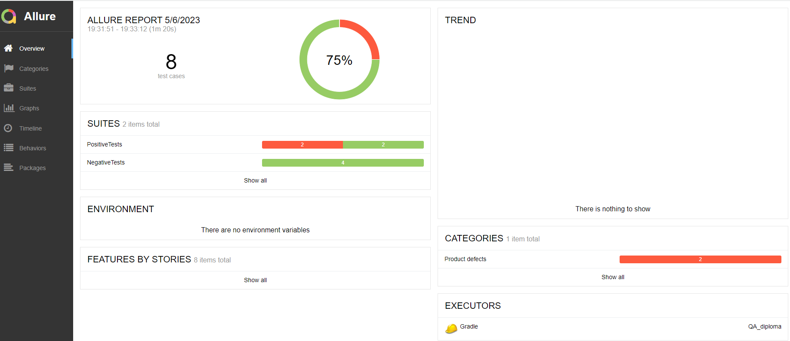

## Описание
Тестировалась форма покупки тура, 2 варианта оплаты: картой и оформление кредита по данным карты.
Разработчики предоставили две карты для тестирования: одна APPROVED, с которой платежи должны проходить, и одна DECLINED, платежи с которой должны отклоняться.
Также к сервису подключалась база данных, MySQL либо PostgreSQL, и проверялось взаимодействие с БД.
Тестирование, ручное и автоматизированное, было проведено для всех сценариев. 

## Тест-кейсы
Всего было подготовлено 8 тест-кейсов, 4 позитивных и 4 негативных.
Позитивные тест-кейсы проверяли корректную работу формы для оплаты/оформления кредита по APPROVED и DECLINED картам.
Негативные тест кейсы проверяли поведение формы в следующих случаях:
- все поля оставлены пустыми
- оплата случайной картой, сгенерированной через библиотеку Faker

## Результаты тестирования
75% тестов прошли успешно, 25% упали. Из 8 тестов 2 завершились с ошибкой: при покупке по APPROVED карте система выдаёт оба сообщения, об ошибке в проведении транзакци и об успешной оплате. Такое поведение было отмечено как для покупки по карте, так и для покупки в кредит.
Интеграция с базами данных прошла успешно, записи о транзакциях записываются в БД, а также тесты получают данные из БД.

## Общие рекомендации
1. Необходимо соотносить результаты ручного и автоматизированного тестирования. При первом прогоне автотестов все 8 проходили успешно, потому что было выставлено условия видимости сообщения об успешной оплате. По факту ручное тестирование показало, что вначале пользователь видит сообщение об ошибке, и уже под ним скрыто сообщение об успешной оплате. Была добавлена проверка на невидимость сообщения об ошибке, после чего результаты автоматизированного тестирования стали соответствовать результатам ручного. 
2. Возможность альтернативного подключения к разным типам БД в рамках одного проекта не представляется целесообразной, так как приводит к генерации дополнительного необязательного кода. 
